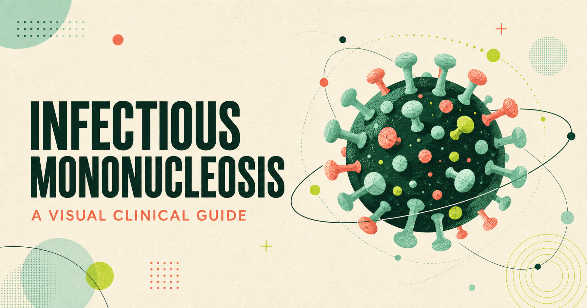

# Infectious Mononucleosis — Interactive Clinical Guide



An interactive, presentation-style introduction to infectious mononucleosis and Epstein–Barr virus (EBV). The deck is designed for students, educators, and anyone looking for a concise visual overview of the clinical presentation, diagnosis, management, complications, and recovery process.

## View the presentation

- **[Open on GitHub Pages](https://mainakbardhan.github.io/infectious-mononucleosis-guide/)**
- **[Open on Cloudflare Pages](https://infectious-mononucleosis-guide.pages.dev/)**

Both links display the same presentation. No account, installation, or purchased domain is required.

## What is included

- Ten responsive presentation slides
- An overview of EBV pathogenesis and transmission
- The classic symptom triad and important examination findings
- A practical diagnostic pathway, including serology interpretation
- Supportive management and return-to-activity guidance
- Red-flag complications such as splenic rupture and airway obstruction
- A three-question interactive knowledge check with explanations

## How to navigate

- Use the **left and right arrow keys** to move between slides.
- Use the **on-screen arrow buttons** on desktop or mobile.
- Open the **menu in the upper-right corner** to jump to any topic.
- Select an answer on the final slide to complete the knowledge check.

## Run it locally

Prerequisite: Node.js 22 or later.

```bash
npm install
npm run dev
```

Open the local address shown in the terminal.

To build the portable static version used by GitHub Pages and Cloudflare Pages:

```bash
npm run build:static
```

## Publishing

Every push to the `main` branch automatically updates the GitHub Pages version through GitHub Actions.

The Cloudflare Pages version can be updated from an authenticated computer with:

```bash
npm run deploy:cloudflare
```

## Medical disclaimer

This presentation is intended for general education and is not a substitute for professional medical advice, diagnosis, or treatment. Clinical decisions should follow current local guidance and consultation with an appropriately qualified healthcare professional.

## Technology

React, TypeScript, Vite, CSS, GitHub Pages, and Cloudflare Pages.
